# Entity Relationships

```mermaid
erDiagram
    Provider ||--o{ Product : owns
    Provider ||--o{ CloudPartition : partitions
    Provider ||--o{ Region : publishes
    Provider ||--o{ AvailabilityZone : publishes
    Provider ||--o{ SourceDocument : provides
    SourceDocument ||--o{ SnapshotRecord : snapshots
    SnapshotRecord ||--o{ IngestionRun : audited_by
    ProductCategory ||--o{ ProductCategory : parent
    ProductCategory ||--o{ Product : classifies
    Product ||--o{ ProductAlias : has
    Product ||--o{ SKU : has
    Product ||--o{ Availability : available_in
    Product ||--o{ ZoneAvailability : available_in_zone
    CloudPartition ||--o{ Region : scopes
    CloudPartition ||--o{ AvailabilityZone : scopes
    CloudPartition ||--o{ Availability : scopes
    CloudPartition ||--o{ ZoneAvailability : scopes
    Region ||--o{ Availability : hosts
    Region ||--o{ AvailabilityZone : contains
    Region ||--o{ ZoneAvailability : hosts
    AvailabilityZone ||--o{ ZoneAvailability : hosts
    SourceDocument ||--o{ Evidence : supports
    ProductCategory ||--o{ SpecificationDefinition : defines
    Product ||--o{ ProductSpecification : measured_by
    SKU ||--o{ ProductSpecification : optionally_scopes
    SpecificationDefinition ||--o{ ProductSpecification : gives_meaning
    Evidence ||--o{ ProductSpecification : supports
    CanonicalFieldDefinition ||--o{ NormalizationRule : targeted_by
    ProductSpecification ||--o{ NormalizedSpecification : normalized_from
    Product ||--o{ NormalizedSpecification : has
    SKU ||--o{ NormalizedSpecification : optionally_scopes
    Evidence ||--o{ NormalizedSpecification : supports
    CanonicalFieldDefinition ||--o{ NormalizedSpecification : defines
    NormalizationRule ||--o{ NormalizedSpecification : produced_by
    NormalizationRun ||--o{ NormalizedSpecification : created_in
    CanonicalFieldDefinition ||--o{ ComparabilityAssessment : assessed_by
    Product ||--o{ ComparabilityAssessment : source
    Product ||--o{ ComparabilityAssessment : target
    NormalizationRun ||--o{ ComparabilityAssessment : created_in
    Provider ||--o{ PriceSKU : publishes
    Product ||--o{ PriceSKU : priced_as
    SKU ||--o{ PriceSKU : optionally_scopes
    Region ||--o{ PriceSKU : scoped_to
    PriceSKU ||--o{ PriceSnapshot : snapshots
    Evidence ||--o{ PriceSnapshot : supports
    Product ||--o{ ProductMapping : source
    Product ||--o{ ProductMapping : target
    Evidence ||--o{ ProductMapping : supports
    Product ||--o{ CompetitiveClaim : source
    Product ||--o{ CompetitiveClaim : target
    Evidence ||--o{ CompetitiveClaim : supports
```

## Cardinality

- One provider has many products, regions, availability zones, source
  documents, and price catalog items.
- One provider can have many cloud partitions. AWS commercial global is modeled
  as partition `aws`; Aliyun domestic public cloud is modeled as
  `aliyun_public_cn`; AWS China, AWS GovCloud, Aliyun Hong Kong, and Aliyun
  overseas scopes require separate partitions or future reviewed tasks.
- One source document can have many snapshot records across captured versions.
- One snapshot record can be referenced by many ingestion runs when identical
  content is observed again.
- One product category has many products and can have many child categories.
- One product has many aliases, SKUs, availability records, specification values,
  price catalog items, mappings, and claims.
- One availability row has a target scope. Week 4 AWS availability rows use
  `target_type=product` and do not imply SKU, family, service tier, or feature
  availability.
- One availability zone belongs to one parent Region and one cloud partition.
- One zone availability row has a target scope. Week 5 Aliyun rows use
  `target_type=product` and do not imply SKU, family, service tier, or feature
  availability.
- One source document has many evidence excerpts.
- One specification definition has many product specification values.
- One canonical field can have many normalization rules and normalized
  specification values.
- One normalized specification is derived from one product specification and one
  evidence row.
- One normalization run can create many normalized specifications and
  comparability assessments.
- One comparability assessment is a field-level readiness row between two
  products; it is not a product mapping.
- One `PriceSKU` has many `PriceSnapshot` rows; snapshots are append-only.
- `ProductMapping` is directional and not a generic many-to-many join table.

## Lifecycle

- Source documents and evidence are historical records. New versions are added;
  old versions are not overwritten.
- Product specifications can have `valid_from` and `valid_to` to preserve history.
- Price snapshots are immutable time-series records.
- Claims can expire with `valid_to` and must retain evidence.

## Deletion Policy

- Historical tables use `RESTRICT` so evidence and prices are not accidentally
  removed.
- Optional evidence references in availability, zone availability, and mappings
  use `SET NULL` only where the row can remain as an unknown or pending-review
  record.
- Repositories prefer soft disable (`is_active=false`) or status changes over
  physical deletion.
