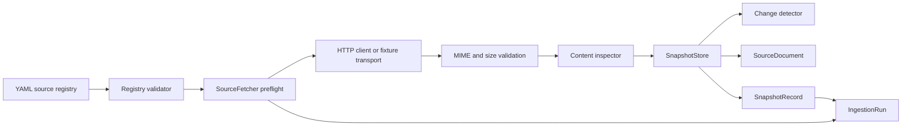

# Ingestion Architecture

## Flow

## Components

- `cloud_expert.ingestion.registry`: Pydantic contracts, YAML loader, and
  registry validation.
- `cloud_expert.ingestion.security`: URL, domain, redirect, path, and header
  safety controls.
- `cloud_expert.ingestion.client`: HTTPX client setup and test fixture transport.
- `cloud_expert.ingestion.fetcher`: fetch orchestration, retry, response
  validation, storage, and database recording.
- `cloud_expert.ingestion.content`: lightweight HTML, JSON, and PDF metadata
  inspection.
- `cloud_expert.ingestion.storage`: atomic writes, hashing, manifest generation,
  latest pointer management, and deduplication.
- `cloud_expert.ingestion.change_detection`: manifest comparison and structured
  change reports.

## Database Additions

Week 2 adds:

- `snapshot_record`: database index of immutable raw snapshots by source,
  content hash, current flag, and previous version pointer.
- `ingestion_run`: audit record for every fetch attempt, including blocked and
  failed attempts.

`SourceDocument` remains the bridge into the Week 1 evidence model. Week 2 does
not create `Evidence` rows or normalized product facts.

## Network Posture

Real network fetching is conservative and disabled in tests by default. The
default fixture registry uses `.invalid` URLs and local fixture transports so
test runs do not contact external sites.

