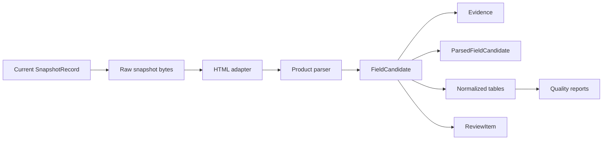

# Parsing Architecture

## Purpose

Week 3 introduces deterministic, snapshot-backed parsing for curated Huawei
Cloud ECS and OBS sources. The parser layer turns immutable official HTML
snapshots into reviewed candidates, evidence records, normalized product facts,
and quality reports.

## Flow

## Components

- `cloud_expert.parsing.html_adapter`: HTML-to-text/table adapter using
  BeautifulSoup.
- `cloud_expert.parsing.models`: parser-neutral field candidates and parse
  summaries.
- `cloud_expert.parsing.pipeline`: orchestration, persistence, idempotence, and
  review item creation.
- `cloud_expert.ingestion.providers.huawei_cloud.ecs`: ECS source mappings,
  parser, schemas, validators, and connector.
- `cloud_expert.ingestion.providers.huawei_cloud.obs`: OBS source mappings,
  parser, schemas, validators, and connector.
- `cloud_expert.ingestion.providers.aws.ec2`: AWS EC2 commercial global source
  mappings and parser.
- `cloud_expert.ingestion.providers.aws.s3`: AWS S3 commercial global source
  mappings and parser.
- `cloud_expert.ingestion.providers.aliyun.ecs`: Aliyun ECS domestic China
  public cloud mappings and parser.
- `cloud_expert.ingestion.providers.aliyun.oss`: Aliyun OSS domestic China
  public cloud mappings and parser.
- `cloud_expert.normalization`: unit, percentage, boolean, ECS, and OBS
  canonicalization helpers.
- `cloud_expert.quality`: evidence link checks, coverage checks, consistency
  checks, and report generation.

## Persistence Rules

Every parse creates a `ParsingRun` row. Every extracted field creates a
`ParsedFieldCandidate` row with raw value, normalized value, canonical value,
canonical unit, confidence, parser rule, locator, excerpt, target table, and
target identity.

High-confidence candidates may be persisted into normalized tables. Candidates
below the review threshold still keep their evidence but open `ReviewItem`
records. Re-running the parser on unchanged snapshots is idempotent for
normalized facts and evidence; parsing runs and candidate rows remain
append-only audit history.

## Boundaries

- Parsers never fetch URLs directly.
- Parsers only read registered source snapshots.
- Parsers do not parse prices.
- Parsers do not generate sales claims or competitive mappings.
- Parsers do not use LLMs, embeddings, vector search, browser automation,
  credentials, cookies, or customer data.
- Product-page marketing text can support product descriptions or feature
  evidence, but not quantitative SKU facts unless the locator and source section
  support it directly.

## Week 4 AWS Notes

- AWS parsers are selected by `provider_code=aws` and product code `ec2` or
  `s3`.
- EC2 instance type rows become `ec2_sku` records and are persisted as `SKU`
  plus `ProductSpecification`.
- EC2 family values become `ProductFamily` records with family type
  `aws_ec2_instance_family`.
- S3 storage classes become `s3_storage_class` records and are persisted as
  `ServiceTier`.
- AWS endpoint tables become product-level `region_availability` records.
  Parsers filter AWS China and AWS GovCloud Region codes out of the commercial
  `aws` partition.

## Week 5 Aliyun Notes

- Aliyun parsers are selected by `provider_code=aliyun` and product code `ecs`
  or `oss`.
- ECS instance types become `aliyun_ecs_sku` records and are persisted as `SKU`
  plus `ProductSpecification`.
- ECS family values become `ProductFamily` records with family type
  `aliyun_ecs_instance_family`.
- OSS storage classes become `aliyun_oss_storage_class` records and are
  persisted as `ServiceTier`.
- Aliyun ECS Region/Zone tables become product-level `region_availability` and
  `zone_availability` records. Parsers filter China Hong Kong, overseas,
  government, finance, special, and zone-like pseudo-Region codes out of
  `aliyun_public_cn`.
- Aliyun API reference pages are parsed as official documentation snapshots
  only. The parser does not call Aliyun APIs or use credentials.
